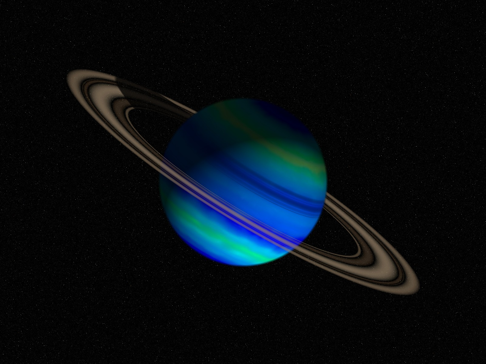

# Planet

## Introduction

Simply put, this program will map any picture (any resolution, any depth up to the memory limit) around a sphere (hence forth referred to as a planet). The planet is then shaded based on the location of a light source. The mapping is done by equating constant latitude and longitude lines around the planet with constant horizontal and vertical lines on the map. The planet view is computed by applying a transformation based on input planet rotation angles. The result can be saved as a 24 bit image at any resolution.

The method used to shade the planet involves taking the cosine of the angle between the normal vector on the surface of the planet and the light source vector and multiplying each color component with the result.

Both the planet rotation and the light source position are specified in terms of rotations about the three axes, x, y, and z. Counterclockwise rotation is positive and clockwise is negative. These angles can be specified in any order. The resulting rotations are very dependent on this order of input.

Any number of planets, moons, or rings may be generated in one image. Also, any number of pictures may be placed in the image. Both planets and pictures may be placed anywhere on the screen by specifying the center location.

An option for generating moons is included to allow for logical placement of planets with respect to each other. If a moon is specified then its location is determined from a distance from the planet center and the rotation of the respective planet.

Additionally, rings may be generated, relative to a planet, by specifying an image map that is mapped on a ring centered around the planet by defining an inner and outer radius. The generated ring image will be shaded based on the specified light source location and planet position.

## Prerequisites

* [The Regina REXX interpreter - regina-rexx version 3.9.3](https://sourceforge.net/projects/regina-rexx/files/regina-rexx/3.9.3/)
  * [development files - libregina3-dev](https://sourceforge.net/projects/regina-rexx/files/regina-rexx/3.9.3/)
* Optional - [Netpbm](http://netpbm.sourceforge.net/)

## Documentation

